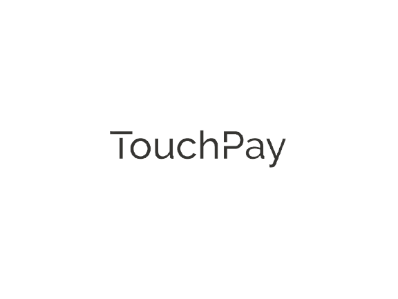

# TouchPay

**TouchPay was founded on a dream of creating a global consumer technology company from Konya. We started our journey in 2021 with the vision of planting seeds for the future.**

Our goal at TouchPay is to gather people with high capabilities, strong values and a will to shape TouchPay’s story. \n\nTo start realising our big dreams, we choose social network as our first and main area of focus. \nSocial network is one of the few truly universal activities that transcends age, gender or nationality and we believe with the right product, we could reach billions of people worldwide.

**Touch Other Lives With Your Steps**
**Take an Action For Other People**

## ✨ Requirements
* Any Operating System (ie. MacOS X, Linux, Windows)
* Any IDE with Flutter SDK installed (ie. IntelliJ, Android Studio, VSCode etc)
* A little knowledge of Dart and Flutter
* A brain to think 🤓🤓

## ✨ Screens it contains:

- [x] Splash Screen.
- [x] Welcome Screen
- [x] Home Page
- [x] Profile Page
- [x] Rank Page.

## ✨ Features

- [x] Step Data
- [x] Calories
- [x] Distance
- [x] Ranking Users (Day, Week, Month, Year)
- [x] TouchPay News
- [x] Our Sponsors
